# 🛡️ DIGITAL SIGNATURES: Interactive Cryptographic Presentation

A state-of-the-art, cinematic, and story-driven presentation deck designed using **Next.js**, **Framer Motion**, **Tailwind CSS**, and **HTML5 Canvas**. The presentation features custom interactive simulators, real-time math calculators, and high-fidelity transitions to explain hashing, encryption, and digital signatures from historical origins to modern implementations.

---

## 📊 Presentation Architecture Diagram

Below is the system class diagram representing the routing model, navigational linkages, and specific interactive simulation components.

```mermaid
classDiagram
    class Home {
        -int currentSlide
        -int TOTAL
        +useEffect() keydownListener
        +next() void
        +restart() void
        +renderSlide() JSX.Element
    }

    class Navbar {
        -int currentSlide
        -int total
        -function goToSlide
        +getActiveCategory() string
    }

    class KeyspaceZoomSimulator {
        -HTMLCanvasElement canvasRef
        -float currentZoom
        -float targetZoom
        +animate() void
        +drawLayer(int level) void
        +handleSliderChange(float val) void
    }

    class Section1Hero {
        -function onNext
    }

    class Section2WhatIsSignature {
        -function onNext
    }

    class Section3HamzaStory {
        -function onNext
        -int panelIdx
    }

    class SectionProcessAnimated {
        -function onNext
        -int activeStep
        +triggerStepAnimation() void
    }

    class Section6HashExplain {
        -function onNext
        -string inputText
        -string hashOutput
        +renderAvalancheMatrix() void
    }

    class Section9Steganography {
        -function onNext
        -int slaveStage
        +nextStage() void
    }

    class Section9Caesar {
        -function onNext
        -int caesarShift
        -string inputText
        +encryptCaesar() string
    }

    class SectionEncryptionRSA {
        -function onNext
        -int primeP
        -int primeQ
        -int modulusN
        -int publicE
        -int privateD
        +generateKeys() void
        +encryptDecrypt() void
    }

    class SectionRSAWhyHash {
        -function onNext
        -float docSizeMB
        +runSimulation() void
    }

    class Section13DocDroc {
        -function onNext
        +upload +POST /:id/sign
    }

    class Section14Closing {
        -function onRestart
        +handleConfetti() void
    }

    Home --> Navbar : "renders & synchronizes state"
    Home --> Section1Hero : "renders Slide 01"
    Home --> Section2WhatIsSignature : "renders Slide 02"
    Home --> Section3HamzaStory : "renders Slides 03-07"
    Home --> SectionProcessAnimated : "renders Slide 10"
    Home --> Section6HashExplain : "renders Slide 13"
    Home --> KeyspaceZoomSimulator : "renders inside Slides 14-21"
    Home --> Section9Steganography : "renders Slide 24"
    Home --> Section9Caesar : "renders Slide 25"
    Home --> SectionEncryptionRSA : "renders Slide 27"
    Home --> SectionRSAWhyHash : "renders Slide 28"
    Home --> Section13DocDroc : "renders Slide 29"
    Home --> Section14Closing : "renders Slide 30"
```



---

## ⚡ Core Interactive Modules

### 1. Keyspace Zoom Simulator ($2^{256}$ Scale)
To show the astronomical scale of SHA-256 security, we built an HTML5 Canvas simulation spanning 8 distinct zoom levels. It utilizes smooth exponential easing:
$$\text{scale} = 7^{(\text{level} - \text{currentZoom})}$$
Transitions smoothly render magnetic particles, rotating planetary wireframes, spiral galaxy structures, and cosmological time counters using `requestAnimationFrame`.

### 2. Live Modular RSA Calculator
A fully functional mathematical RSA key generator that allows the presenter to choose prime numbers (e.g., $p=3, q=11$) and instantly calculates the public modulus ($n=33$), private exponent ($d=7$), and public exponent ($e=3$). It solves modular exponentiation step-by-step using a custom precision loop:
$$c = m^e \pmod n \quad \text{and} \quad m = c^d \pmod n$$

### 3. Pipeline Rationale Simulator (Direct RSA vs. Hash-and-Sign)
Features an interactive file-size slider demonstrating why entire document encryption is non-viable. It contrasts direct encryption locks (which scale linearly in file size and hit hard memory limits) against modern secure hashing pipelines where a file is compressed to a 32-byte digest before asymmetric signing.

---

## 🛠️ Getting Started

### Prerequisites
Make sure you have Node.js (version 18+) installed.

### Installation
1. Clone the repository and navigate to the project directory:
   ```bash
   cd IS_presentation
   ```
2. Install dependencies:
   ```bash
   npm install
   ```
3. Run the development server:
   ```bash
   npm run dev
   ```
4. Open [http://localhost:3000](http://localhost:3000) in your browser.

---

## 📦 Production Compilation

To generate the optimized static HTML5 production build:
```bash
npm run build
```
This command compiles and outputs static pages under the `.next/` and `out/` directories with zero compilation overhead.
